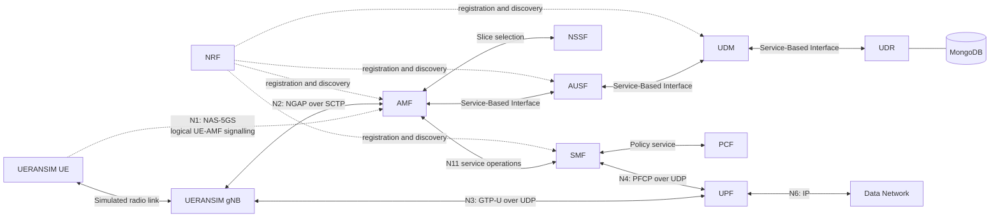

# 5G SA Core Protocol Lab

## Overview

This repository contains a complete local 5G Standalone (5G SA) protocol lab
built with Open5GS and UERANSIM on Ubuntu. The validated baseline connects a
simulated gNodeB (gNB) to the 5G Core, authenticates and registers a synthetic
User Equipment (UE), establishes an IPv4 Protocol Data Unit (PDU) session, and
passes bidirectional traffic through the User Plane Function (UPF).

The repository includes reproducible configurations and scripts, reviewed
Wireshark captures, successful and failed protocol traces, Linux networking
evidence, five controlled fault experiments, and a tested Python validation
tool.

All subscriber identifiers, credentials, addresses, and network names are
synthetic lab values. They must not be reused for a production network.

## Verified Results

| Capability | Result | Evidence |
| --- | --- | --- |
| Open5GS core readiness | PASS | [Environment and service record](docs/01_environment_setup.md) |
| gNB SCTP association and NG Setup | PASS | [Registration flow](docs/03_successful_registration_flow.md) |
| 5G-AKA authentication and NAS security | PASS | [Registration evidence](reports/registration_validation.md) |
| UE registration | PASS | [Wireshark and log analysis](docs/03_successful_registration_flow.md) |
| IPv4 PDU session | PASS | [PDU-session flow](docs/04_pdu_session_flow.md) |
| UE tunnel and default route | PASS | [UE interface report](reports/ue_interface_success.md) |
| Bidirectional user-plane traffic | PASS | [Connectivity evidence](reports/user_plane_validation.md) |
| NGAP, NAS-5GS, PFCP, and GTP-U analysis | PASS | [Packet-capture guide](docs/05_packet_capture_guide.md) |
| Controlled fault experiments | 5 complete | [Failure evidence index](captures/failures/README.md) |
| Automated lab validation | PASS | [Latest validation report](reports/latest_lab_check.md) |
| Python unit tests | 17 PASS | [Test suite](tests/test_lab_check.py) |

## Project Goals

- Implement a functioning local 5G SA control plane and user plane.
- Correlate simulator state, core logs, Linux networking, and packet captures.
- Separate transport success from 5G procedure success.
- Verify registration and PDU-session establishment as independent stages.
- Inspect N2, N3, N4, and N6 behavior with protocol-aware evidence.
- Reproduce common configuration and routing faults one variable at a time.
- Automate repeatable lab-state validation without modifying the running lab.

## Architecture



The control plane authenticates the UE, creates registration and session
state, and programs forwarding behavior. The user plane carries the UE's
actual IP packets. The Access and Mobility Management Function (AMF) does not
forward the UE's ping traffic; the gNB and UPF carry it through the N3 GPRS
Tunnelling Protocol User Plane (GTP-U) tunnel.

The [architecture reference](docs/reference/01_full_architecture_map.md)
contains the expanded topology, control/user-plane separation, and protocol
stack.

## Capabilities Demonstrated

- Open5GS network-function deployment and service verification
- UERANSIM gNB and UE integration
- Synthetic subscriber provisioning and 5G Authentication and Key Agreement
- Non-Access-Stratum security and registration analysis
- PDU-session establishment and Data Network Name selection
- Linux network namespaces, tunnel interfaces, routing, forwarding, and NAT
- NGAP, NAS-5GS, PFCP, GTP-U, SCTP, UDP, IP, and ICMP analysis
- Controlled fault injection, root-cause localization, and baseline recovery
- Safe Bash orchestration and packet-capture helpers
- Standard-library Python validation and unit testing
- Evidence-focused technical documentation

## Lab Components

| Component | Full name | Responsibility in this lab |
| --- | --- | --- |
| UE | User Equipment | Requests registration and data connectivity |
| gNB | gNodeB | Connects the simulated access side to the core |
| AMF | Access and Mobility Management Function | Terminates NAS signalling and manages access, registration, and mobility state |
| AUSF | Authentication Server Function | Supports 5G subscriber authentication |
| UDM | Unified Data Management | Manages subscriber and authentication information |
| UDR | Unified Data Repository | Provides persistent subscriber data backed by MongoDB |
| NRF | Network Repository Function | Registers and discovers available core functions |
| NSSF | Network Slice Selection Function | Assists selection of the configured network slice |
| PCF | Policy Control Function | Supplies policy information used during session handling |
| SMF | Session Management Function | Creates PDU sessions and programs the UPF |
| UPF | User Plane Function | Forwards UE packets between N3 and N6 |
| MongoDB | Document database | Stores the synthetic Open5GS subscriber record |
| Wireshark/tshark | Packet-analysis tools | Decode and filter signalling and user-plane evidence |
| `lab_check.py` | Python validation tool | Produces a read-only PASS/FAIL report across the dependency chain |

## Interfaces and Protocols

| Reference point | Endpoints | Protocol | Purpose |
| --- | --- | --- | --- |
| N1 | UE and AMF, logically through gNB | NAS-5GS | Registration, authentication, security, and session signalling |
| N2 | gNB and AMF | NGAP over SCTP | Access-network setup, UE context, and NAS transport |
| N3 | gNB and UPF | GTP-U over UDP/2152 | Encapsulated UE user traffic |
| N4 | SMF and UPF | PFCP over UDP/8805 | User-plane session and forwarding-rule control |
| N6 | UPF and data network | IPv4/ICMP in the verified test | External data-network traffic |
| SBI | 5G Core control functions | HTTP-based service operations | Function registration, discovery, authentication, policy, and session services |

## Repository Structure

```text
5g-sa-core-protocol-lab/
├── configs/       Reviewed Open5GS, UERANSIM, and fault configurations
├── scripts/       Core, gNB, UE, capture, networking, and fault helpers
├── tools/         Python lab validator
├── tests/         Validator unit tests
├── docs/          Architecture, procedure, setup, and analysis references
├── captures/      Reviewed successful and controlled-failure packet evidence
├── reports/       Concise validation and protocol-analysis results
├── screenshots/   Cropped terminal and Wireshark evidence
└── diagrams/      Architecture and call-flow index
```

## Quick Start

### Prerequisites

- Ubuntu 24.04
- Open5GS and MongoDB
- UERANSIM built under `~/UERANSIM`, or `UERANSIM_ROOT` set to its location
- `ip`, `ping`, `tcpdump`, `tshark`, `ss`, and `iptables`
- The synthetic subscriber and matching baseline values described in the
  [configuration map](docs/configuration_map.md)

The configuration files are evidence-backed lab baselines, not production
defaults.

### 1. Verify the core

From the repository root:

```bash
./scripts/run/start_core.sh
```

This starts any inactive required MongoDB/Open5GS services, verifies all
required units, and confirms the AMF N2 SCTP listener.

### 2. Enable the runtime UE data path

```bash
./scripts/network/enable_ue_nat.sh
```

This idempotent helper enables IPv4 forwarding and installs scoped forwarding
and masquerade rules for `10.45.0.0/16`. The rules are runtime-only and must be
restored after a reboot.

### 3. Start the gNB

In a dedicated terminal:

```bash
./scripts/run/start_gnb.sh 2>&1 | tee /tmp/5g-lab-gnb.log
```

The expected readiness marker is:

```text
NG Setup procedure is successful
```

### 4. Start the UE

In another terminal:

```bash
./scripts/run/start_ue.sh 2>&1 | tee /tmp/5g-lab-ue.log
```

The successful baseline includes:

```text
Initial Registration is successful
PDU Session establishment is successful
```

### 5. Validate the complete path

Identify the live UERANSIM namespace:

```bash
sudo ip netns list
```

Refresh the terminal's `sudo` authorization, then run the validator with the
reported namespace:

```bash
sudo -v
python3 tools/lab_check.py \
  --gnb-log /tmp/5g-lab-gnb.log \
  --ue-log /tmp/5g-lab-ue.log \
  --namespace ueransim-999700000000001-internet-psi1 \
  --target 8.8.8.8 \
  --output reports/latest_lab_check.md
```

The validator checks commands, services, ports, gNB setup, registration,
PDU-session state, the UE tunnel and route, and connectivity from inside the
UE namespace. See the [validation tool reference](tools/README.md) for every
option and exit code.

### 6. Run the unit tests

```bash
python3 -m unittest discover -s tests -v
```

The suite uses controlled command results and log fixtures; it does not start
or reconfigure Open5GS, UERANSIM, routing, or firewall state.

## Successful 5G Registration

The verified registration sequence is:

```text
gNB SCTP association
  -> NG Setup Request / Response
  -> UE RRC connection
  -> NAS Registration Request
  -> 5G-AKA Authentication Request / Response
  -> NAS Security Mode Command / Complete
  -> Registration Accept / Complete
```

The capture proves that N2 transport, NGAP acceptance, subscriber lookup,
authentication, NAS security, and registration completed. Registration alone
does not prove that the UE has a working data path.

Detailed evidence:

- [Successful registration flow](docs/03_successful_registration_flow.md)
- [Registration tshark summary](captures/successful/registration_summary.txt)
- [Reviewed N2 capture](captures/successful/n2_registration_attempt.pcap)
- [Registration screenshot](screenshots/successful_registration.png)


## PDU Session and User-Plane Traffic

After registration, the UE requested DNN `internet` on Single Network Slice
Selection Assistance Information (S-NSSAI) with Slice/Service Type (SST) `1`.
The SMF created PFCP state on the UPF, the core and gNB exchanged N3 tunnel
information, and UERANSIM created `uesimtun0` in an isolated namespace.

```text
PDU Session Establishment Request
  -> SMF selection and session authorization
  -> PFCP Session Establishment
  -> NGAP PDU Session Resource Setup
  -> PFCP Session Modification
  -> PDU Session Establishment Accept
  -> UE IPv4 address and default route
  -> bidirectional GTP-U and ICMP
```

The successful run assigned `10.45.0.2/24` in the reviewed full capture and
proved five bidirectional ICMP exchanges through the N3 GTP-U tunnel and N6
path.

Detailed evidence:

- [PDU-session and user-plane flow](docs/04_pdu_session_flow.md)
- [UE interface and connectivity report](reports/ue_interface_success.md)
- [Reviewed full capture](captures/successful/full_successful_run.pcap)
- [User-plane tshark summary](captures/successful/pdu_session_summary.txt)


## Packet Capture Analysis

| Wireshark/tshark filter | Evidence isolated |
| --- | --- |
| `sctp` | N2 transport association and shutdown |
| `ngap` | gNB-to-AMF procedures |
| `nas-5gs` | UE registration and session-management messages when decodable |
| `pfcp` | SMF-to-UPF session control |
| `gtp` | N3 user-plane encapsulation |
| `gtp && icmp` | ICMP carried inside GTP-U |
| `icmp && !gtp` | Decapsulated or N6-side ICMP |

The [packet-capture guide](docs/05_packet_capture_guide.md) documents capture
points, filters, protocol landmarks, encapsulation, TEID correlation, and
safe evidence reduction.

## Controlled Failure Scenarios

Each experiment changed exactly one baseline variable or scoped runtime rule,
identified the last successful stage and first failed boundary, restored the
baseline, and captured the successful recovery.

| Scenario | Controlled change | Observed failure boundary | Evidence |
| --- | --- | --- | --- |
| Wrong PLMN | gNB MNC `70` changed to `71` | SCTP succeeded; NG Setup was rejected | [Analysis](captures/failures/wrong_plmn/README.md) |
| Wrong TAC | gNB TAC `1` changed to `2` | AMF could not match the served TAI; NG Setup was rejected | [Analysis](captures/failures/wrong_tac/README.md) |
| Wrong subscriber key | One synthetic key digit changed | AUTN MAC validation failed before NAS security | [Analysis](captures/failures/wrong_subscriber_key/README.md) |
| Wrong DNN | UE requested `unsupported` | Registration passed; PDU-session establishment failed | [Analysis](captures/failures/wrong_dnn/README.md) |
| Missing NAT | Scoped UE MASQUERADE rule removed | Session and uplink GTP-U passed; external return traffic failed | [Analysis](captures/failures/missing_nat/README.md) |

The [controlled-failure method](docs/06_failure_scenario_guide.md) explains
the isolation, evidence, restoration, and verification rules shared by all
five experiments.

## Python Automation

[`tools/lab_check.py`](tools/lab_check.py) is a read-only, standard-library
validator. It executes timeout-controlled commands without `shell=True`,
parses current gNB and UE logs, inspects the UE namespace, and renders
structured results into Markdown.

```text
required commands
  -> MongoDB/Open5GS services
  -> N2/N3/N4/SBI/database listeners
  -> gNB SCTP and NG Setup
  -> UE registration
  -> PDU session
  -> UE tunnel and default route
  -> UE-namespace connectivity
```

Supporting material:

- [Tool usage and exit codes](tools/README.md)
- [Implementation reference](docs/07_python_lab_validator_walkthrough.md)
- [Unit tests](tests/test_lab_check.py)
- [Successful live report](reports/latest_lab_check.md)
- [Automation validation record](reports/automation_validation.md)

## Technical Documentation

| Document | Scope |
| --- | --- |
| [Architecture map](docs/reference/01_full_architecture_map.md) | Complete component and packet-path model |
| [Network functions](docs/reference/02_network_functions.md) | Responsibilities and interactions |
| [Interfaces, protocols, planes, and layers](docs/reference/03_interfaces_protocols_planes_and_layers.md) | Protocol stack and control/user-plane relationships |
| [Identifiers and configuration](docs/reference/04_identifiers_and_configuration.md) | PLMN, TAI, SUPI, S-NSSAI, DNN, SEID, and TEID |
| [End-to-end procedures](docs/reference/05_end_to_end_procedures.md) | Setup, registration, session, data, and release sequence |
| [Packet analysis and troubleshooting](docs/reference/06_packet_analysis_and_troubleshooting.md) | Evidence correlation and failure localization |
| [Acronym glossary](docs/reference/07_acronym_glossary.md) | Expanded 5G, Linux, and protocol terms |
| [Platform setup reference](docs/platform_setup/README.md) | Ubuntu, Open5GS, MongoDB, and UERANSIM baseline |
| [Configuration map](docs/configuration_map.md) | Cross-component value contracts |

## Technical Lessons

- SCTP association proves N2 transport reachability; NG Setup proves that the
  AMF accepted the gNB's 5G configuration.
- UE registration and PDU-session establishment are separate procedures with
  independent success criteria.
- Control-plane success does not guarantee user-plane reachability.
- PLMN, TAC, subscriber credentials, S-NSSAI, and DNN form cross-component
  configuration contracts.
- PFCP creates UPF forwarding state; GTP-U carries the resulting user traffic.
- Namespace-based connectivity testing prevents ordinary host traffic from
  being mistaken for UE traffic.
- Logs explain component decisions, captures prove message exchange, and Linux
  state proves the local data path; reliable diagnosis correlates all three.
- A one-variable fault method makes cause and recovery evidence reproducible.

## Future Improvements

The verified single-UE baseline is complete. Optional extensions include:

- multiple concurrent UEs and PDU sessions;
- `iperf3` throughput and loss measurements;
- multiple DNNs or S-NSSAIs;
- JSON output and packet-landmark extraction in the validator;
- continuous metrics with Prometheus and Grafana;
- reproducible host deployment automation;
- an additional Radio Access Network implementation.

## References

- [3GPP TS 23.501: System architecture for the 5G System](https://www.3gpp.org/dynareport/23501.htm)
- [3GPP TS 23.502: Procedures for the 5G System](https://www.3gpp.org/dynareport/23502.htm)
- [3GPP TS 24.501: NAS protocol for the 5G System](https://www.3gpp.org/dynareport/24501.htm)
- [3GPP TS 38.413: NG-RAN; NG Application Protocol](https://www.3gpp.org/dynareport/38413.htm)
- [Open5GS documentation](https://open5gs.org/open5gs/docs/)
- [UERANSIM configuration reference](https://github.com/aligungr/UERANSIM/wiki/Configuration)
- [Wireshark display-filter reference](https://www.wireshark.org/docs/dfref/)
