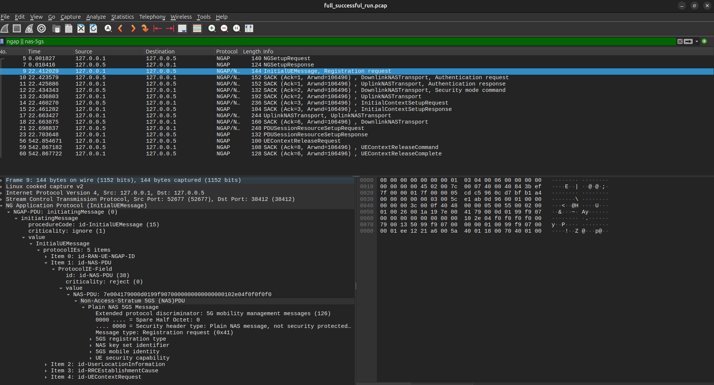
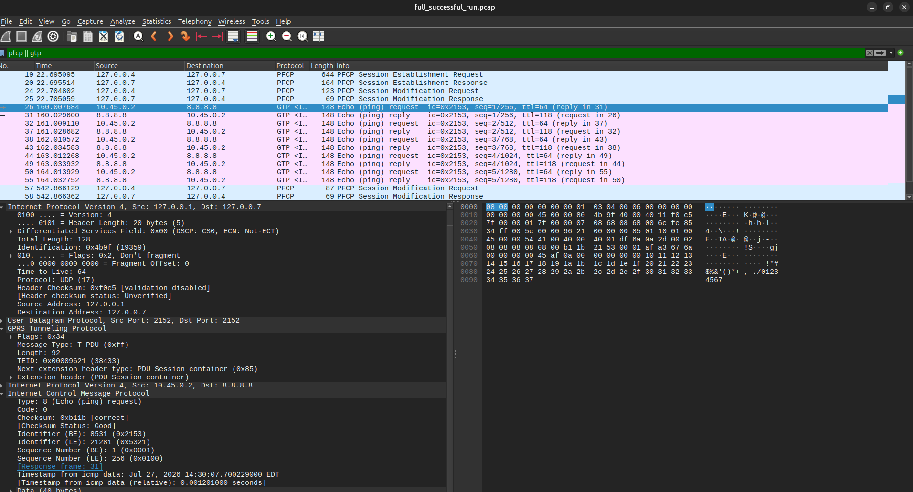

# 5G SA Packet Capture Guide

## Status

Phase 8 is complete.

This guide explains how to capture, filter, and interpret a successful Open5GS
and UERANSIM run from SCTP association through UE release.

## Evidence Set

| Evidence | Purpose |
| --- | --- |
| [`full_successful_run.pcap`](../captures/successful/full_successful_run.pcap) | Reviewed full-lifecycle packet capture |
| [`registration_summary.txt`](../captures/successful/registration_summary.txt) | SCTP, NGAP, and NAS registration landmarks |
| [`pdu_session_summary.txt`](../captures/successful/pdu_session_summary.txt) | PFCP, GTP-U, ICMP, and session landmarks |
| [`wireshark_ngap_nas.png`](../screenshots/wireshark_ngap_nas.png) | NGAP carrying a NAS Registration Request |
| [`wireshark_pfcp_gtpu.png`](../screenshots/wireshark_pfcp_gtpu.png) | PFCP setup and GTP-U user traffic |

The capture contains 64 reviewed packets and uses only synthetic lab identity
data and technically relevant addresses.

## What The Capture Proves

The capture joins the control and user planes into one timeline:

```text
SCTP association
  -> NG Setup
  -> UE registration and authentication
  -> NAS security
  -> PFCP session programming
  -> NGAP PDU-session resource setup
  -> bidirectional GTP-U/ICMP
  -> UE context release
  -> PFCP cleanup
  -> SCTP shutdown
```

The packet order matters. The gNB first establishes transport and N2
signalling. The UE then registers. The SMF programs the UPF before the first
user packet crosses N3. Finally, the core releases access and user-plane state.

## Interface And Protocol Map

| Interface | Endpoints | Protocol | Function |
| --- | --- | --- | --- |
| N1 | UE and AMF | NAS-5GS | UE registration, authentication, security, and session signalling |
| N2 | gNB and AMF | NGAP over SCTP | Access control and transport of NAS messages |
| N3 | gNB and UPF | GTP-U over UDP `2152` | Encapsulated UE user traffic |
| N4 | SMF and UPF | PFCP over UDP `8805` | User-plane rule installation and updates |
| N6 | UPF and data network | IP | Decapsulated user traffic |

N1 is a logical UE-to-AMF interface. In the observed packet path, the UE sends
NAS through the simulated radio connection to the gNB. The gNB places that NAS
payload inside an NGAP message on N2.

## Capture Filters And Display Filters

A capture filter decides which packets enter the file. A display filter
selects from packets that are already present.

If a capture filter excludes a packet, that packet cannot be recovered later.
Changing a display filter never changes the saved capture.

### Broad Roadmap Capture

```bash
sudo tcpdump -i any \
  -w captures/successful/full_successful_run.pcap
```

This records every protocol visible to the host. It can include unrelated
traffic, so it requires careful review.

### Focused Lab Capture

The reproducible helper uses:

```text
sctp port 38412 or udp port 8805 or udp port 2152 or icmp
```

Run it with:

```bash
cd ~/projects/5g-sa-core-protocol-lab
./scripts/run/capture_pdu_session.sh \
  captures/successful/full_successful_run.pcap
```

The helper:

- captures on Linux pseudo-interface `any`;
- records complete packets with snapshot length `0`;
- uses `dumpcap` when capture permissions are available;
- otherwise falls back to `tcpdump` with `sudo`;
- refuses to overwrite an existing capture.

### Why Capture On `any`

The lab uses loopback endpoints, `ogstun`, the UE TUN path, and the physical
outbound interface. Capturing on `any` observes these different points in one
file.

The same logical ping can appear several times:

1. inside GTP-U on N3;
2. as plain UE-addressed IP after decapsulation;
3. as address-translated IP on N6.

These observations represent packet transformations, not three separate pings
from the UE.

## Display Filter Reference

| Filter | Use |
| --- | --- |
| `sctp` | Show N2 transport, association setup, acknowledgements, and shutdown |
| `ngap` | Show gNB-to-AMF N2 procedures |
| `nas-5gs` | Show NAS messages Wireshark can decode |
| `ngap || nas-5gs` | Follow registration and session signalling |
| `sctp.port == 38412` | Select the standard NGAP transport port |
| `pfcp` | Show SMF-to-UPF N4 control |
| `udp.port == 8805` | Select PFCP by port |
| `gtp` | Show GTP-U user-plane packets |
| `udp.port == 2152` | Select GTP-U by port |
| `gtp && icmp` | Show ping packets inside GTP-U |
| `icmp && !gtp` | Show plain ICMP outside the GTP-U wrapper |
| `pfcp || gtp` | Compare UPF programming with later user traffic |
| `icmp` | Show every decoded ping observation |

## Command-Line Analysis

### Capture Metadata

```bash
capinfos captures/successful/full_successful_run.pcap
```

Important fields include:

- file format and encapsulation;
- packet count and size;
- first and last timestamps;
- capture duration;
- timestamp ordering;
- SHA-256 hash.

### Registration And NAS

```bash
tshark \
  -r captures/successful/full_successful_run.pcap \
  -Y "ngap || nas-5gs"
```

For a compact table:

```bash
tshark \
  -r captures/successful/full_successful_run.pcap \
  -Y "ngap || nas-5gs" \
  -T fields \
  -e frame.number \
  -e frame.time_relative \
  -e ip.src \
  -e ip.dst \
  -e _ws.col.Info
```

### PFCP And GTP-U

```bash
tshark \
  -r captures/successful/full_successful_run.pcap \
  -Y "pfcp || gtp"
```

### ICMP

```bash
tshark \
  -r captures/successful/full_successful_run.pcap \
  -Y "icmp"
```

### GTP-U With Inner ICMP

```bash
tshark \
  -r captures/successful/full_successful_run.pcap \
  -Y "gtp && icmp" \
  -T fields \
  -e frame.number \
  -e ip.src \
  -e ip.dst \
  -e gtp.teid \
  -e icmp.type \
  -e _ws.col.Info
```

When a field exists in both the outer and inner headers, tshark returns both
values separated by commas.

## Wireshark Workflow

Open the reviewed capture without `sudo`:

```bash
wireshark captures/successful/full_successful_run.pcap
```

Wireshark normally presents three panes:

1. Packet List: one row per packet.
2. Packet Details: decoded protocol hierarchy and fields.
3. Packet Bytes: raw hexadecimal and text representation.

Start with the packet list to identify a procedure. Then select a packet and
expand only the layers needed to answer a question.

## SCTP And NG Setup

Frames `1` through `4` establish the SCTP association:

| Frame | SCTP chunk | Meaning |
| ---: | --- | --- |
| 1 | INIT | gNB proposes an SCTP association |
| 2 | INIT ACK | AMF acknowledges and returns a state cookie |
| 3 | COOKIE ECHO | gNB returns the cookie |
| 4 | COOKIE ACK | AMF accepts the association |

Frames `5` and `7` then carry NG Setup Request and Response.

SCTP is the transport. NGAP is the signalling protocol carried by that
transport. A working SCTP association alone does not prove that the AMF has
accepted the gNB; NG Setup Response provides that proof.

## NAS Inside NGAP

Frame `9` is:

```text
InitialUEMessage, Registration request
```

The layer nesting is:

```text
IPv4
  -> SCTP
     -> NGAP InitialUEMessage
        -> NAS-PDU
           -> NAS-5GS Registration Request
```

This demonstrates the difference between logical N1 signalling and physical
N2 transport. The UE originates NAS, the gNB relays it, and the AMF terminates
it.

The NGAP/NAS image is:



### Protected NAS Limitation

The Registration Request, Authentication Request, Authentication Response, and
Security Mode Command are directly named in this capture.

After NAS security activation, Wireshark can identify the enclosing NGAP
transport and security header, but it cannot completely name encrypted inner
messages without derived session keys. Simulator output and timestamps are
therefore correlated with:

- protected Security Mode Complete;
- Registration Accept;
- Registration Complete;
- PDU Session Establishment Request and Accept.

The permanent subscriber key and OPC are not transmitted in these messages.

## PFCP Session Programming

The core programs user-plane state before sending traffic:

| Frame | Message | Direction |
| ---: | --- | --- |
| 19 | PFCP Session Establishment Request | SMF to UPF |
| 20 | PFCP Session Establishment Response | UPF to SMF |
| 24 | PFCP Session Modification Request | SMF to UPF |
| 25 | PFCP Session Modification Response | UPF to SMF |

The establishment request creates initial state. After the gNB supplies its N3
tunnel information, modification completes the forwarding path.

Common PFCP rule concepts are:

- PDR: detects packets belonging to a session;
- FAR: defines the forwarding action;
- QER: defines QoS enforcement when present;
- F-TEID: identifies a GTP-U tunnel endpoint.

PFCP is control-plane traffic. It installs rules but does not carry the UE's
ping payload.

## NGAP PDU-Session Resources

Frames `21` and `23` are:

```text
PDU Session Resource Setup Request
PDU Session Resource Setup Response
```

This procedure coordinates the access-side N3 resource between core and gNB.
It appears between PFCP establishment and PFCP modification in this run.

## GTP-U Encapsulation

Frame `26` is the first uplink ICMP echo request inside GTP-U:

```text
Outer IP: 127.0.0.1 -> 127.0.0.7
UDP:      2152 -> 2152
TEID:     0x00009621
Inner IP: 10.45.0.2 -> 8.8.8.8
Payload:  ICMP Echo Request
```

Frame `31` is its downlink reply:

```text
Outer IP: 127.0.0.7 -> 127.0.0.1
TEID:     0x00000001
Inner IP: 8.8.8.8 -> 10.45.0.2
Payload:  ICMP Echo Reply
```

The uplink and downlink TEIDs differ because each receiving endpoint assigns
the tunnel identifier it expects on its direction.

The PFCP/GTP-U image is:



## Following One Ping

The first ping appears as:

| Frame | Observation | Addresses |
| ---: | --- | --- |
| 26 | Uplink GTP-U | outer `127.0.0.1 -> 127.0.0.7`, inner `10.45.0.2 -> 8.8.8.8` |
| 27 | Decapsulated request | `10.45.0.2 -> 8.8.8.8` |
| 28 | N6 request after translation | `192.168.0.32 -> 8.8.8.8` |
| 29 | N6 reply before reverse translation | `8.8.8.8 -> 192.168.0.32` |
| 30 | Reply restored to UE address | `8.8.8.8 -> 10.45.0.2` |
| 31 | Downlink GTP-U | outer `127.0.0.7 -> 127.0.0.1`, inner `8.8.8.8 -> 10.45.0.2` |

The same six-frame transformation repeats for all five successful echo
requests and replies.

## Control Plane Versus User Plane

The capture separates the two roles:

```text
Control plane:
  SCTP + NGAP + NAS-5GS + PFCP
  Establish identity, security, session, and forwarding state

User plane:
  GTP-U + inner IPv4/ICMP + N6 IPv4/ICMP
  Carry the UE's data after session setup
```

The most direct proof is temporal:

```text
PFCP setup: approximately 22.7 seconds
First GTP-U ping: approximately 160.0 seconds
```

User traffic appears after the required control-plane state exists.

## Controlled Teardown

Stopping the UE while capture and gNB remained active produced:

| Frame | Event |
| ---: | --- |
| 56 | UE Context Release Request |
| 57-58 | PFCP Session Modification exchange |
| 59 | UE Context Release Command |
| 60 | UE Context Release Complete |
| 62 | SCTP Shutdown |
| 63 | SCTP Shutdown Acknowledgement |
| 64 | SCTP Shutdown Complete |

This demonstrates cleanup of access and user-plane state rather than an
abruptly truncated capture.

## Evidence Review

Before including a capture:

1. Confirm that subscriber identities and addresses are synthetic.
2. Confirm that permanent authentication material is absent.
3. Inspect every unique endpoint.
4. Remove unrelated background packets and periodic keepalives.
5. Confirm that required protocol landmarks remain.
6. Check packet order with `capinfos`.
7. Record a SHA-256 hash.
8. Add an ignored pcap intentionally only after review.

The raw local capture contained 715 packets and zero kernel drops. The reviewed
file contains 64 technically relevant packets in strict timestamp order.

## Phase 8 Result

**COMPLETE:** The repository contains a reviewed full-lifecycle pcap, concise
tshark summaries, protocol filters, two Wireshark evidence images, and a
control-plane versus user-plane interpretation.

## Next Step

Phase 9 can use this successful baseline to compare intentionally introduced
failure symptoms, missing messages, rejected procedures, and recovery steps.
