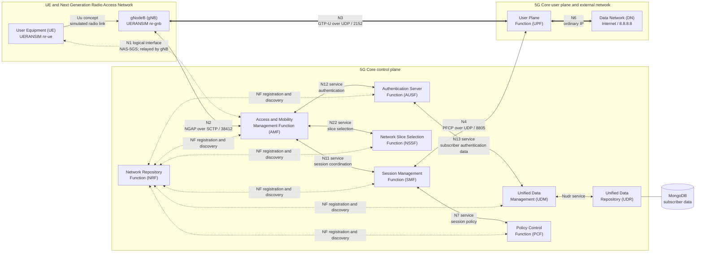

# Full 5G Standalone Architecture Map

## The Three Large Regions

A 5G Standalone system can first be divided into three regions:

| Region | Full name | Responsibility in this lab |
| --- | --- | --- |
| UE | User Equipment | Acts as the subscriber device and originates NAS signalling and IP traffic |
| NG-RAN | Next Generation Radio Access Network | Connects the UE to the core through the gNodeB |
| 5GC | 5G Core | Authenticates the UE, manages mobility and sessions, and forwards user data |

The external Data Network (DN) is not part of the 5G Core. It is the network
the UE reaches through the core, such as the Internet.

## Practical Architecture



The solid arrows show important communication paths. The dotted N1 arrow is
logical: the UE does not open an IP connection directly to the AMF. The gNB
relays the UE's NAS message inside NGAP on N2.

## The Same Map As Plain Text

```text
User Equipment (UE)
    |
    | simulated radio link
    v
gNodeB (gNB)
    | \
    |  \ N3: GTP-U over UDP -- user packets ----------+
    |                                                 |
    | N2: NGAP over SCTP -- access signalling         v
    v                                          User Plane Function
Access and Mobility Management Function              |
    |                                                 | N6: ordinary IP
    | N11                                             v
    +---------------- Session Management Function   Data Network
    |                          |
    |                          | N4: PFCP
    |                          v
    |                   User Plane Function
    |
    +-- Authentication Server Function
    |        |
    |        +-- Unified Data Management
    |                 |
    |                 +-- Unified Data Repository -- MongoDB
    |
    +-- Network Slice Selection Function
    |
    +-- Network Repository Function for service discovery

Logical N1 relationship:
User Equipment -- NAS-5GS, relayed by gNB --> AMF
```

## Control Path And User Path

The two most important paths are intentionally different.

### Control path

```text
UE
  -> NAS over the simulated radio link
  -> gNB
  -> NGAP over SCTP on N2
  -> AMF
  -> core services over the Service-Based Interface
```

This path performs registration, authentication, security, mobility, and
session coordination. It does not carry the UE's ping payload.

### User path

```text
UE IP packet
  -> UERANSIM UE tunnel
  -> gNB
  -> GTP-U over UDP on N3
  -> UPF
  -> ordinary IP on N6
  -> Data Network
```

This path exists only after the control plane creates the required state.

## How The Single-Host Lab Represents The Architecture

All logical components run on one Ubuntu computer, but they still use
different processes, addresses, interfaces, and protocols.

| Architectural element | Lab implementation |
| --- | --- |
| UE | UERANSIM `nr-ue` process |
| Radio connection | UERANSIM software link; no real radio-frequency transmission |
| gNB | UERANSIM `nr-gnb` process |
| 5G Core control functions | Separate Open5GS services |
| User Plane Function | Open5GS `open5gs-upfd` service |
| Subscriber store | MongoDB accessed through the UDR |
| UE-side network | Linux network namespace containing `uesimtun0` |
| UPF-side UE network | Linux `ogstun` interface |
| Data network | Host routing and the external Internet connection |

Loopback addresses such as `127.0.0.1`, `127.0.0.4`, `127.0.0.5`, and
`127.0.0.7` let separate processes behave like distinct endpoints without
requiring several physical machines.

## UERANSIM Radio Limitation

UERANSIM provides a functional simulation of UE and gNB signalling needed to
test a 5G Core. It does not reproduce a complete physical radio channel.

In a real 5G radio stack, the Uu interface includes:

- Radio Resource Control (RRC);
- Packet Data Convergence Protocol (PDCP);
- Radio Link Control (RLC);
- Medium Access Control (MAC);
- physical radio processing.

UERANSIM models the control behavior needed for core testing and uses a
software connection between its UE and gNB processes. Radio propagation,
waveforms, scheduling performance, and real over-the-air behavior are outside
this lab's scope.

## Wider 5G Core Context

The 5G Service-Based Architecture can include additional functions. They are
useful to recognize even though the current baseline does not require them.

| Acronym | Full name | General responsibility | Baseline use |
| --- | --- | --- | --- |
| SCP | Service Communication Proxy | Routes and assists service-based communication between core functions | Not required by the current direct NRF-based paths |
| SEPP | Security Edge Protection Proxy | Protects control signalling exchanged between different operators | Not used; this is a single-network local lab |
| BSF | Binding Support Function | Stores or discovers bindings between a session and its serving policy function | Not required by the tested procedures |
| NEF | Network Exposure Function | Exposes selected core capabilities through controlled interfaces | Not installed for the baseline |
| AF | Application Function | Supplies service or traffic influence information to the core | Not part of the baseline |

These functions do not sit in the UE user-packet path merely because they
exist. Each is contacted only when its service is needed.

## Architectural Conclusions

- N1 is a logical UE-to-AMF relationship; the gNB transports NAS messages
  inside NGAP rather than terminating them.
- The UPF carries UE user packets. The AMF handles access and mobility control.
- The SMF installs forwarding state on the UPF through PFCP.
- gNB-to-AMF success proves N2 control-plane readiness, not N3/N6 user-plane
  reachability.
- UERANSIM models UE and gNB protocol behavior without implementing a complete
  over-the-air New Radio physical layer.
